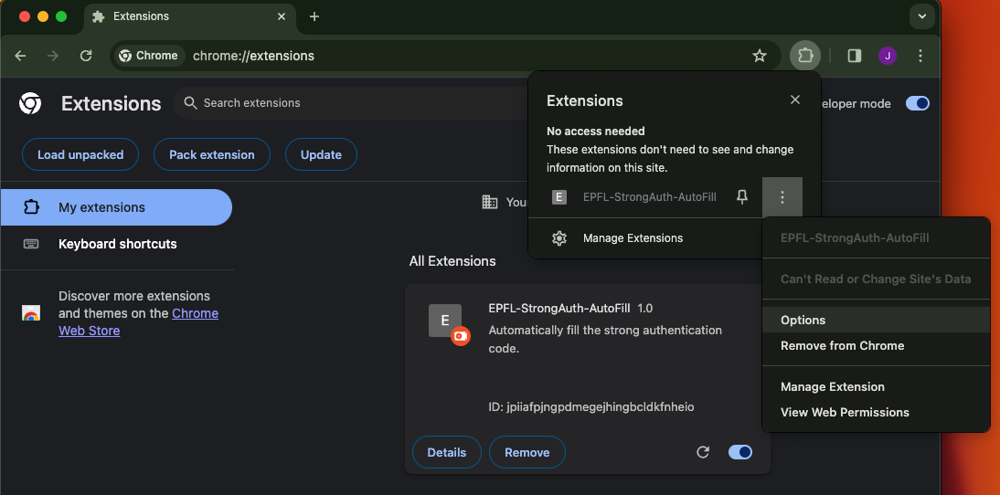

# EPFL-Strong-Authentication-AutoFill

A Chrome extension to automatically fill the strong authentication code for EPFL's email website.

## Export Secret Key from Google Authenticator
1. In the Google Authenticator app, tap **Menu** and then **Transfer accounts** and then **Export accounts**.
2. Take a screenshot of the QR code and copy it to your computer.

## Get the Chrome Extension
1. Download the extension from https://github.com/ljwljwljwljw/EPFL-StrongAuth-AutoFill/releases/download/v1.0.0/chrome_ext.zip and unzip it.
2. In Chrome, go to Extensions page by entering `chrome://extensions` in a new tab.
3. Enable Developer Mode by clicking the toggle switch next to **Developer mode**.
4. Click the **Load unpacked** button and select the folder `chrome_ext`.
5. Click **options**.

6. Upload the QRCode.
7. Go to `https://ewa.epfl.ch/`, after you enter the email and password, click login, the **Secure code** will be automatically filled!

## Desktop App
### MacOS:
```bash
git clone git@github.com:ljwljwljwljw/EPFL-StrongAuth-AutoFill.git
cd EPFL-StrongAuth-AutoFill/totp_app
brew install npm
npm install
npm run package
```
Open `EPFL-StrongAuth-AutoFill/totp_app/out/totp-sync-darwin-arm64` in `Finder`, double click the `totp-sync` to launch the application.